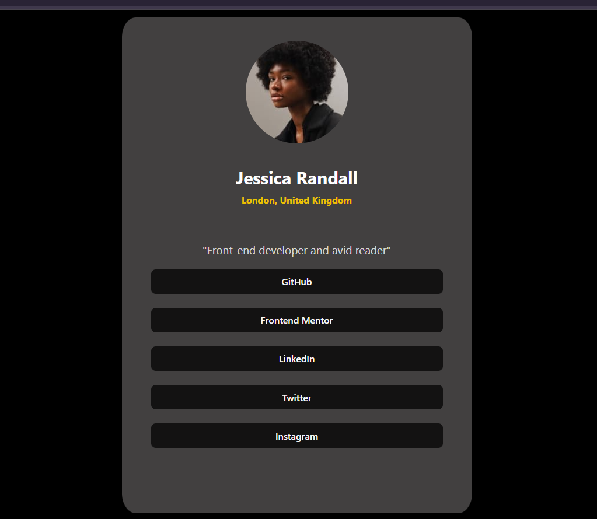

# React + Vite

# Profile Page

This is a **Profile Page** built using **React.ts** and **CSS** for styling. This idea was inspired by Frontend Mentor projects for front-end developers

## Features

### User Features:
1. **Home Page:**
   - Buttons with Links to the following:
     - GitHub
     - Frontend Mentor
     - Linkedin
     - Twitter
     - Instagram

2. **Responsive Design:**
   - The layout adjusts to various screen sizes for optimal usability on mobile, tablet, and desktop devices.

### Navigation Bar:
- **Logo/Title:** Displays the profile page with the name, picture of a user and other details.

## Technology Stack
- **Frontend:** React.ts
- **Styling:** CSS (custom styling for a clean and modern look)

## Images



## Installation

To run this project locally, follow these steps:

1. Clone the repository:
   ```bash
   git clone https://github.com/Cornel-MIT/WorkSpace.git
   ```

2. Install the dependencies:
   ```bash
   cd WorkSpace
   npm install
   ```

3. Start the React development server:
   ```bash
   npm run dev
   ```


- [@vitejs/plugin-react](https://github.com/vitejs/vite-plugin-react/blob/main/packages/plugin-react/README.md) uses [Babel](https://babeljs.io/) for Fast Refresh
- [@vitejs/plugin-react-swc](https://github.com/vitejs/vite-plugin-react-swc) uses [SWC](https://swc.rs/) for Fast Refresh


 **The live URL** = http://localhost:5173/